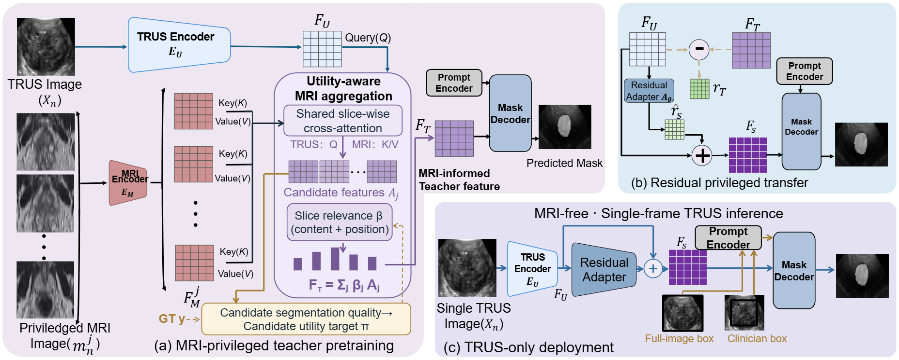

# MIRAUS

**MRI-privileged learning for single-frame TRUS prostate segmentation**

[Interactive Results](https://zeming-huang.github.io/MIRAUS/) | [μRegPro Dataset](https://muregpro.github.io/) | [MedSAM](https://github.com/bowang-lab/MedSAM)

MIRAUS uses paired MRI as privileged information during training to improve a lightweight single-frame TRUS segmentation model. MRI and the privileged teacher are removed after training; deployment requires only one TRUS frame and supports automatic full-image or box-assisted inference.

## Framework

<p align="center">
  <a href="assets/miraus-framework.png">
    
  </a>
</p>

The privileged teacher uses a local multi-slice MRI neighborhood during training and forms an MRI-informed feature through utility-aware aggregation. A residual adapter transfers the teacher-defined feature increment to the TRUS student. At deployment, the MRI branch and teacher are removed, leaving the same lightweight student for automatic full-image or clinician box-assisted segmentation.

## Interactive Results

The [result explorer](https://zeming-huang.github.io/MIRAUS/) contains 15 anonymized μRegPro examples. Each example includes apex, mid-gland, and base frames with the manual reference, a TRUS-only baseline, MIRAUS, and the signed probability difference. The gallery contains favorable, representative, and difficult cases.

## Code Layout

- `train_dual_modal.py`: privileged teacher pretraining and offline student distillation.
- `enhanced_dual_modal.py`: cross-modal aggregation, mask decoder, and residual student adapter.
- `tiny_vit_sam.py`: lightweight image encoder and feature modules.
- `inference_3D.py`: TRUS-only inference for preprocessed volumes.
- `evaluate_comprehensive.py`: overlap and surface-distance evaluation.
- `utils/paired_dataset.py`: paired MRI/TRUS training data loading.
- `tools/`: formal evaluation, baseline, and result-export utilities.
- `docs/`: static result explorer published through GitHub Pages.

## Installation

```bash
git clone https://github.com/Zeming-Huang/MIRAUS.git
cd MIRAUS
pip install -e .
```

The implementation was developed with Python 3.10 and PyTorch 2.x. CUDA is recommended for training and inference.

## Deployment Contract

The deployed student accepts a single TRUS frame. MRI, the teacher network, and adjacent TRUS slices are training-time resources only and are not required for inference.

## Data and Checkpoints

Experiments use the public μRegPro MRI-TRUS cohort. Dataset files and model checkpoints are not committed to Git. Preprocessing, split manifests, and checkpoint download instructions will be included with the archival release.

## Reproducing the Result Explorer

The public gallery is static and contains no patient identifiers. Its anonymized assets can be regenerated from local out-of-fold predictions with:

```bash
python tools/build_results_browser_assets.py \
  --source-root /path/to/train/us_images \
  --source-root /path/to/val/us_images
```

## License

Code is distributed under the repository license and remains subject to the licenses of the upstream MedSAM, LiteMedSAM, TinyViT, and MobileSAM components. Web examples are provided under the μRegPro CC BY-NC-SA 4.0 terms.

## Acknowledgements

MIRAUS builds on MedSAM, LiteMedSAM, TinyViT, MobileSAM, and Segment Anything. We thank their authors for releasing the corresponding research code.
